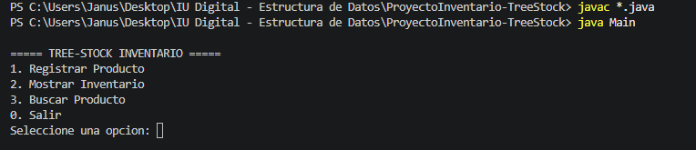
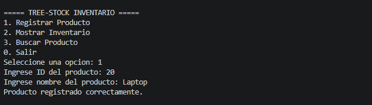
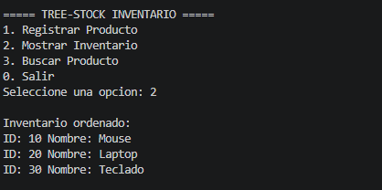
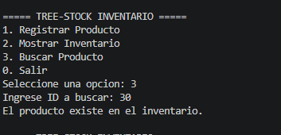
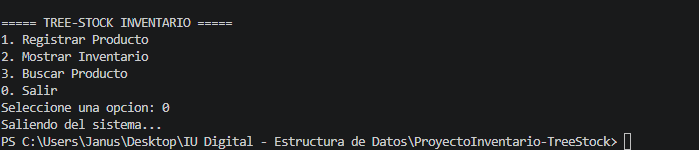

# 🌳 Tree-Stock – Sistema de Inventario con Árbol Binario en Java

## 📌 Autor

Nombre: Yeremy Jesus Berdugo Valencia

Curso: Estructura de Datos

Proyecto: Tree-Stock

Repositorio: (https://github.com/Vesumon/ProyectoInventario-TreeStock)

Video de sustentación: (https://youtu.be/Y0n_jeGdXR0)

---

## 🎯 Objetivo del Proyecto

Desarrollar una aplicación en Java que permita comprender e implementar la estructura de datos **Árbol Binario de Búsqueda (BST)** mediante un sistema de inventario.

El sistema permite registrar productos, organizarlos automáticamente y buscarlos de manera eficiente utilizando nodos enlazados.

---

## 🧠 Conceptos Aplicados

* Implementación manual de **Árbol Binario de Búsqueda (BST)**
* Uso de **nodos enlazados**
* Manejo de **referencias (punteros)**
* Recursividad en inserción y búsqueda
* Recorrido **inorden** para ordenamiento automático

---

## 🏗️ Arquitectura del Sistema

El sistema funciona mediante un **árbol binario de búsqueda**, donde:

* Cada nodo representa un producto
* El subárbol izquierdo contiene IDs menores
* El subárbol derecho contiene IDs mayores

### Operaciones implementadas:

* **Insertar** → Ubica el producto en su posición correcta
* **Buscar** → Localiza un producto por ID
* **Recorrido Inorden** → Muestra los productos ordenados

---

## 📂 Estructura del Proyecto

```
Tree-Stock
│
├─ src
│   ├─ Producto.java
│   ├─ ArbolInventario.java
│   └─ Main.java
│
├─ capturas
│   ├─ Menu.png
│   ├─ Registro.png
│   ├─ Inventario.png
│   └─ Busqueda.png
│
├─ README.md
└─ .gitignore
```

---

## ⚙️ Cómo Ejecutar el Programa

1. Abrir el proyecto en Visual Studio Code
2. Abrir la terminal
3. Ir a la carpeta `src`

```
cd src
```

4. Compilar:

```
javac *.java
```

5. Ejecutar:

```
java Main
```

---

## 🖥️ Menú del Sistema

```
1. Registrar Producto
2. Mostrar Inventario
3. Buscar Producto
0. Salir
```

---

## 📸 Evidencia de Ejecución

### Menú del programa



### Registro de producto



### Inventario ordenado



### Búsqueda de producto



### Salida del Sistema



---

## 🎥 Video de Sustentación

En el siguiente video se explica:

* Funcionamiento del programa
* Implementación del árbol binario
* Uso de punteros izquierdo y derecho
* Recorrido inorden
* Búsqueda de productos

Link del video:
(https://youtu.be/Y0n_jeGdXR0)

---

## 📚 Conclusión

Este proyecto permitió comprender el funcionamiento del **árbol binario de búsqueda**, implementando nodos enlazados y lógica recursiva.

Se evidenció cómo esta estructura permite organizar datos automáticamente y realizar búsquedas eficientes dentro de un sistema de inventario.
